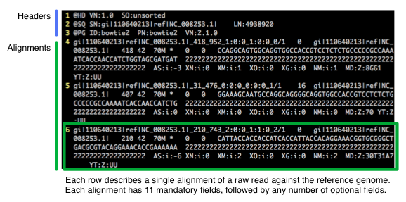

# SAMtools:  A Primer

by Ethan Cerami, Ph.D.

**keywords:**  samtools, next-gen, next-generation, sequencing, bowtie, sam, bam, primer, tutorial, how-to, introduction

## Work in Progress: This document is currently a work in progress.  It is not ready for use or release. ##

## Revisons ##

* 0.1: April 23, 2013:  This document is **currently a work in progress.  It is not ready for release.**

## About ##

SAMtools is a popular open-source tool, commonly used in next-generation sequence analysis.  This short primer provides an introduction to using SAMtools, and is geared towards those new to next-generation sequence analysis.  The primer is also designed to be self-contained and hands-on, meaning that you only need to install SAMtools, and no other tools, and sample data sets are provided.  Terms in **bold** are also explained in the short glossary at the end of the document.

## Introduction to SAMtools and Next-Generation Sequence Analysis

Next-generation sequencing refers to new, cheaper, high-throughput technologies for sequencing the DNA or RNA of a single sample or a group of samples.  A typical work-flow for next-generation sequence analysis is usually composed of multiple steps:

1. DNA is extracted from a sample.
2. DNA is sequenced.
3. Raw sequencing reads are aligned to a reference genome.
4. The aligned reads are evaluated and visualized. 
5. Genomic variants, including single nucleotide polymorphisms (SNPs) and small insertions and deletions are identified.

SAMtools fits in at steps 4 and 5.  Most importantly, it can process aligned sequence reads, and manipulate them with ease.  For example, it can convert between the two most common file formats (SAM and BAM), sort and index files (for speedy retrieval later), and extract specific genomic regions of interest.  It also enables quality checking of reads, and automatic identification of genomic variants.

## Downloading and Installing SAMtools

To get started with the rest of this primer, download the SAMtools source code from [SourceForge.net](http://sourceforge.net/projects/samtools/files/).  Then, unzip and unpack the distribution to your preferred location &ndash;&ndash; for example, I have placed samtools at:  ~/libraries/samtools-0.1.19/.

Samtools is written in C, compiled with gcc and make, and has only two dependencies:  the [GNU curses library](http://www.gnu.org/software/ncurses/), and the [ZLib compression library](http://zlib.net/).  If you are using a modern variant of Linux or MacOS X, chances are good that you already have these libraries installed.

To build samtools, type:

	make
	
And, add the executables to your path.  For example, I have modified my `.bash_profile` like so:

	export SAMTOOLS_HOME=/Users/ecerami/libraries/samtools-0.1.19
	export PATH=$SAMTOOLS_HOME:$PATH
	export PATH=$SAMTOOLS_HOME/bcftools/:$PATH
	export PATH=$SAMTOOLS_HOME/misc/:$PATH

As an optional, but recommended step, copy the man page for `samtools.1` to one of your man page directories (1). 

## Tutorial:  A Complete Workflow for Identifying SNPs in E. coli

To illustrate the use of SAMtools, the remainder of this document focuses on using SAMtools within a complete sample workflow for next-generation sequence analysis.  For simplicity, the tutorial uses a small set of simulated reads from *E. coli*.  I have chosen *E. coli* because its genome is quite small -- 4,649 kilobases, with 4,405 genes, and its entire genome fits into a single **FASTA** file of 4.8 megabytes.  The sample read file is also small -- just 790K -- enabling you to download both within a few minutes.  

If you are new to next-generation sequence analysis, you will soon find that one of the biggest obstacles is just finding and downloading sample data sets, and then downloading the very large reference genomes.  By focusing on *E. coli* and simulated data sets, you can start small, learn the tool sets, and then advance to other organisms and larger sample data sets.

### An Overview

The workflow below is organized into six steps:

1.  Generate a small set of simulated reads for *E. coli*.
2.  Align the reads to the reference *E. coli* genome.
3.  Convert the aligned reads from the **SAM** file format to **BAM**.
4.  Sort and index the **BAM** file.
5.  Identify genomic variants.
6.  Visualize the reads and genomic variants.

Steps 3-6 are focused on the use of SAMtools.  Steps 1-2 require the use of other tools.  Steps 1-2 do, however provide important context, may be helpful in the future, and are therefore described below.  That said, you are not required to actually perform any of steps yourself now, as intermediate files from these steps are available for download.  You can download these intermediate files directly and proceed with steps 3-6.

### Step 1:  Generate Simulated Reads

First, we need a small set of sample read data.  A number of tools, including [ArtificialFastqGenerator](http://sourceforge.net/p/artfastqgen/wiki/Home/), [SimSeq](https://github.com/jstjohn/SimSeq), will generate artificial or simulated sequence data for you.  For this tutorial, I chose to use the [wgsim](https://github.com/lh3/wgsim) tool (created by Heng Li, also the creator of SAMtools).

The command line usage for wgsim is:

	wgsim [options] <in.ref.fa> <out.read1.fq> <out.read2.fq>
  
By default, wgsim therefore reads in a reference genome in the **FASTA** format, and generates simulated **paired-end** reads in the **FASTQ** format.

If you specify the full [*e. coli* genome](https://raw.github.com/ecerami/samtools_primer/master/tutorial/genomes/NC_008253.fna), wgsim will generate simulated reads across the entire genome.  However, for the tutorial, I chose to restrict the simulated reads to just the first 1,000 bases of the *e. coli* genome.  To do so, I  extracted the first 1K bases of the *e. coli* genome, placed these within a new file:  [NC_008253_truncated.fna](https://raw.github.com/ecerami/samtools_primer/master/tutorial/genomes/NC_008253_1K.fna), and ran:

	wgsim -N1000 -S1 genomes/NC_008253_truncated.fna output/sim_reads.fq /dev/null
	
Command line options are described below:

* `-N1000`:  directs wgsim to generate 1,000 simulated reads (default is set to:  1,000,000).
* `-S1`:  specifies a seed for the wgsim random number generator;  by specifying a seed value, one can reproducibily create simulated reads.
* `/dev/null`:  wgswim requires that you specify two output files (one for each set of pair-end reads).  However, if you set the second output to `/dev/null`, all data for the second set of reads will be discarded, and you can effectively generate single-end read data only.

wgsim will then output:

	[wgsim] seed = 1
	[wgsim_core] calculating the total length of the reference sequence...
	[wgsim_core] 1 sequences, total length: 1000
	gi|110640213|ref|NC_008253.1|	736	T	G	-

This indicates that wgsim has read in a reference sequence of 1K and has generated simulated reads to support exactly one artificial SNP, a T->G at position 736.  By default, all artificial reads have a read length of 70, and the reads are written in the FASTQ format. For illustrative purposes, the first read is shown below:

	@gi|110640213|ref|NC_008253.1|_418_952_1:0:0_1:0:0_0/1
	CCAGGCAGTGGCAGGTGGCCACCGTCCTCTCTGCCCCCGCCAAAATCACCAACCATCTGGTAGCGATGAT
	+
	2222222222222222222222222222222222222222222222222222222222222222222222

Note that in the FASTQ format, the first line specifies a unique sequence identifier (usually referred to as the QName), the second line specifies the sequence, and the fourth line specifies the **Phred quality score** for each base.  wgsim does not generate artificial quality scores, and all bases are simply set to 2, indicating that the bases have a 0.01995 probability of being called incorrectly (for additional details, refer to **Phred quality scores** in the glossary.)

You can download the [artificial reads from github](https://raw.github.com/ecerami/samtools_primer/master/tutorial/simulated_reads/sim_reads.fq) if you like, but this is not required for the rest of the tutorial.

### Step 2:  Align Reads to a Reference Genome

The next step is to align the artificial reads to the reference genome for *e. coli.*  For this, I have chosen to use the widely used [Bowtie2](http://bowtie-bio.sourceforge.net/bowtie2/index.shtml) aligner, from Johns Hopkins University.  Again, you need not actually perform this step to use SAMtools, but it does provide important context, so I have included the details.

To align, use the command:

	bowtie2 -x indexes/e_coli -U simulated_reads/sim_reads.fq -S alignments/sim_reads_aligned.sam
	
This directs bowtie to align the simulated reads against the *e_coli* reference genome, and to output the alignments in the **SAM file format**.  Details regarding each command line option is provided below:

* `-x`:  the location of the reference genome index files.  Bowtie requires that reference genome indexes be downloaded or built, prior to alignment.  I have provided a [pre-built index for *e_coli* on the github repository](https://github.com/ecerami/samtools_primer/tree/master/tutorial/indexes) for this primer.

* `-U`:  list of unpaired reads to align.

* `-S`:  output alignments in the SAM format to the specified file.

For additional details on using bowtie2, refer to the [online manual](http://bowtie-bio.sourceforge.net/bowtie2/manual.shtml).

### SAM Format Details

As SAMtools is primarily concerned with manipulating SAM files, it is useful to take a moment to examine the sample SAM file generated by bowtie, and to dive into the details of the SAM file format itself.  The first six lines from the bowtie SAM file are extracted below:

## Footnotes

(1)  If you are uncertain where to copy the samtools man page, or are uncertain where your existing man pages are located, try typing:

	man -w

this will display the current set of man paths.  `samtools.1` is considered a "section 1" man page, reserved for user commands.  You therefore need to copy it into a directory named man1.  For example, on my system, I copied `samtools.1` to:  /usr/local/share/man/man1/.

## Glossary

**alignment**:  the mapping of a raw sequence read to a location within a reference genome.  The mapping occurs because the sequences within the raw read match or align to sequences within the reference genome.  Alignment information is stored in the **SAM** or **BAM** file formats.

**bcftools**:  a set of companion tools, currently bundled with samtools, for identifying and filtering genomics variants.

**bowtie**:  widely used, open source alignment software for aligning raw sequence reads to a reference genome.  

**BAM Format**:  binary, compressed format for storing SAM data.

**BCF Format**:  Binary call format.  Binary, compressed format for storing VCF data. 

**FASTA Format**:  text format for storing raw sequence data.  For example, the FASTA file at:  [http://www.ncbi.nlm.nih.gov/nuccore/NC_008253](http://www.ncbi.nlm.nih.gov/nuccore/NC_008253) contains entire genome for Escherichia coli 536. 

**FASTQ Format**:  text format for storing raw sequence data along with quality scores for each base.

**QNAME**:  unique identifier of a raw sequence read (also known as the Query Name).  Used in **FASTQ** and **SAM** files.

**paired-end sequencing**:  sequencing process where both ends of a single DNA or RNA fragment are sequenced, but the intermediate region is not sequenced.  Particularly useful for identifying structural rearrangements, including gene fusions.

**Phred quality score**:  a score assigned to each base within a sequence, quantifying the probability that the base was called incorrectly.  For example, a Phred Q score of 10 indicates that the base has a 0.1 probability of being incorrect, whereas a Phred score of 20 indicates that the base has a 0.01 probability of being incorrect.  Higher Phred score therefore correspond to higher accuracy.  In the **FASTQ format**, Phred scores are represented as single ASCII letters.  For details on translating between Phred scores and ASCII values, refer to [Table 1 of this useful blog post from Damian Gregory Allis](http://www.somewhereville.com/?p=1508).

**read-length**:  the number of base pairs that are sequenced in an individual sequence read.

**read-depth**:  the number of sequence reads that pile up at the same genomic location.  For example, 30X read-depth coverage indicates that the genomic location is covered by 30 independent sequencing reads.  Increased read-depth translates into higher confidence for calling genomic variants.

**RNAME**:  reference genome identifier (also known as the Reference Name).  Within a SAM formatted file, the RNAME identifies the reference genome where the raw read aligns.

**SAM Flag**:  a single integer value (e.g. 16), which encodes multiple elements of meta-data regarding a read and its alignment.  Elements include: whether the read is one part of a paired-end read, whether the read aligns to the genome, and whether the read aligns to the forward or reverse strand of the genome.  A [useful online utility](http://picard.sourceforge.net/explain-flags.html) decodes a single SAM flag value into plain English.

**SAM Format**:  Text file format for storing sequence alignments against a reference genome.  See also BAM Format.

**samtools**:  widely used, open source command line tool for manipulating SAM/BAM files.  Includes options for converting, sorting, indexing and viewing SAM/BAM files.  The samtools distribution also includes bcftools, a set of command line tools for identifying and filtering genomics variants.  Created by Heng Li, currently of the Broad Institute.

**single-read sequencing**:  sequencing process where only one end of a single DNA or RNA fragment is sequenced.  Contrast with **paired-end** sequencing.

**VCF Format**:  Variant call format.  Text file format for storing genomic variants, including single nucleotide polymorphisms, insertions, deletions and structural rearrangement.

## License

SAMtools:  A Primer, by Ethan Cerami is licensed under a [Creative Commons Attribution 3.0 Unported License](http://creativecommons.org/licenses/by/3.0/deed.en_US).
